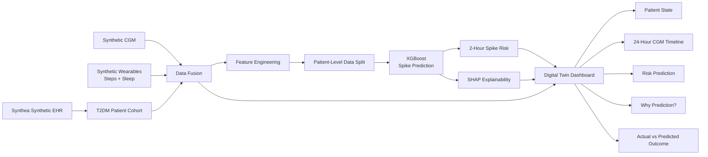

# System Architecture



## Data Flow

### 1. Synthetic EHR

Synthea generates simulated patient records containing demographic, diagnostic, laboratory, and medication information.

### 2. Synthetic Wearable Data

A synthetic data generator produces:

- Continuous glucose measurements at 5-minute intervals
- Step counts
- Sleep-stage signals

### 3. Data Fusion

Static EHR information is joined with dynamic patient time-series data.

Each patient therefore has a combined representation containing:

```
Patient
├── Demographics
├── Laboratory features
├── Medication information
├── CGM
├── Activity
└── Sleep
```

### 4. Feature Engineering

Temporal features are generated from the combined dataset:

- 15-minute glucose change
- 30-minute rolling glucose mean
- 30-minute rolling glucose variability
- 30-minute activity
- Time of day
- Sleep stage
- Static EHR variables

### 5. Prediction

An XGBoost classifier predicts whether glucose will exceed the synthetic modeling target of **160 mg/dL exactly 2 hours ahead**.

### 6. Explainability

SHAP is used to identify the features contributing most strongly to each prediction.

### 7. Digital Twin Dashboard

The Streamlit application combines the patient's current simulated state, model prediction, historical CGM trajectory, activity data, and SHAP explanation into an interactive patient view.

> **Important:** The 160 mg/dL target is a synthetic modeling definition for this proof of concept and is not presented as a clinical diagnostic threshold.

## Current Limitation

The current Synthea pipeline does not include genetic-marker data. Genetic markers are therefore not represented as an input feature; they remain a possible future extension rather than an implied capability of this proof of concept.
